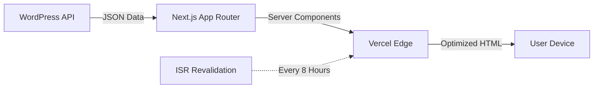
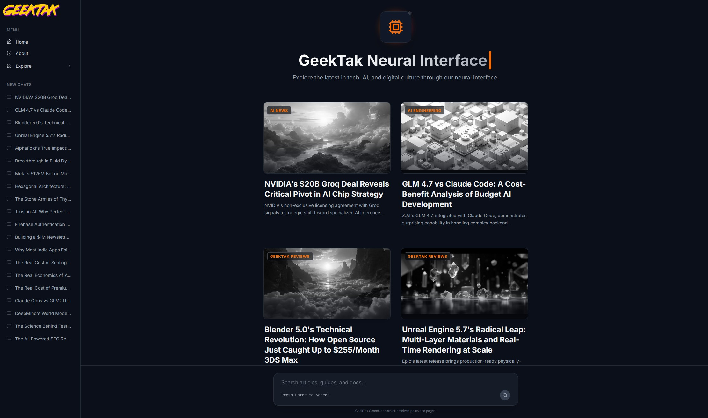
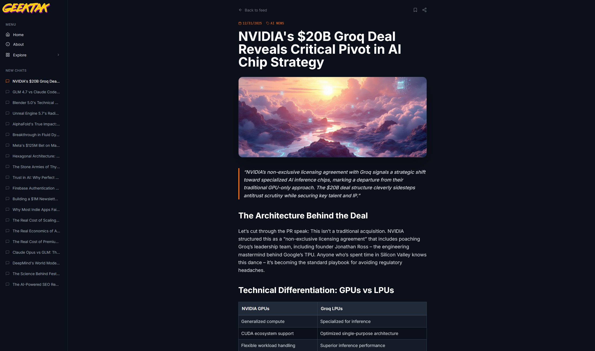
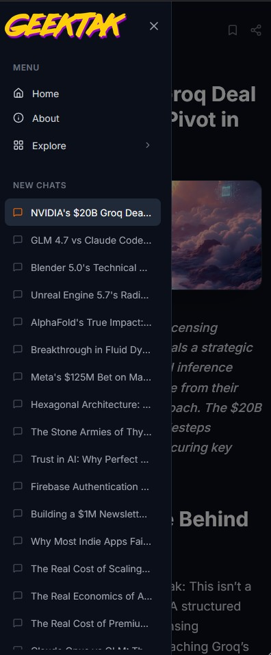
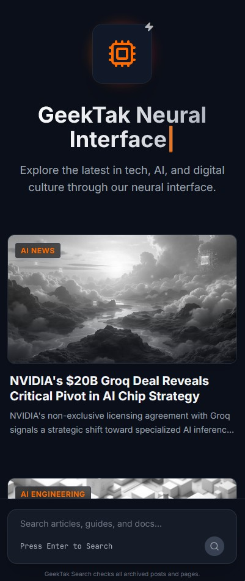

# Geektak: The Neural Interface Platform

**Geektak** is a proprietary digital publishing platform that merges the utility of a content management system with the aesthetic and UX of modern Generative AI interfaces.

> 🔗 **Live Deployment:** [geektak.com](https://geektak.com)

## 💡 The Concept
Traditional blogs are static and passive. Geektak reimagines content consumption by mimicking the "Neural Interface" of tools like ChatGPT and Gemini. It features a persistent state-aware sidebar, typewriter text streaming effects, and a cyber-aesthetic designed for immersion.

## 🏗️ Technical Architecture

The platform utilizes a **Headless Architecture**, separating the content layer (WordPress) from the presentation layer (Next.js).

### Key Components

- **Frontend**: Next.js 16 (App Router) with React Server Components (RSC).
- **Styling**: Tailwind CSS with a custom configuration for "Cyberpunk" aesthetics (neon glows, CRT scanlines).
- **Animation**: Framer Motion for complex page transitions and micro-interactions.
- **Backend**: WordPress operating strictly as a headless API.

## 🚀 Key Features

### 1. Incremental Static Regeneration (ISR)

To balance performance with content freshness, the platform uses Next.js ISR.

- **Strategy**: Pages are statically generated at build time for instant loading.
- **Revalidation**: The system checks for content updates every 8 hours (28800s) or on-demand, ensuring the API is never overwhelmed by direct traffic.

### 2. AI-Native UX Patterns

- **Streaming Text Simulation**: Custom React hooks mimic the "token-by-token" generation of LLMs.
- **Contextual Sidebar**: A self-healing navigation component that maintains state across route transitions, recovering automatically if the API connection is interrupted.

### 3. Resilient Error Handling

The application implements granular Error Boundaries. If a specific component fails (e.g., an API timeout), the rest of the UI remains functional, degrading gracefully rather than crashing the entire application.

## 🎨 Interface Gallery

### Homepage - Neural Interface Design

### Single Post View - Streaming Content

### Mobile Experience

  
  

## 🛠️ Tech Stack

- **Core**: React 19, Next.js 16
- **Language**: TypeScript (Strict Mode)
- **CMS**: WordPress REST API
- **Performance**: next/image optimization, next/font
- **Utilities**: Lucide React, clsx, tailwind-merge

---

**Note**: This repository serves as a technical showcase. The source code is proprietary.
